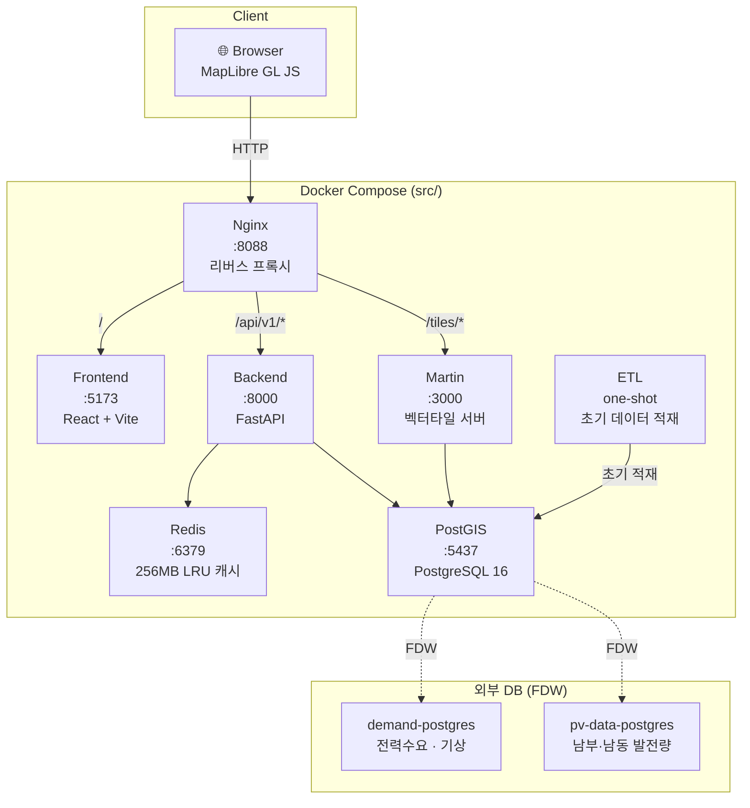
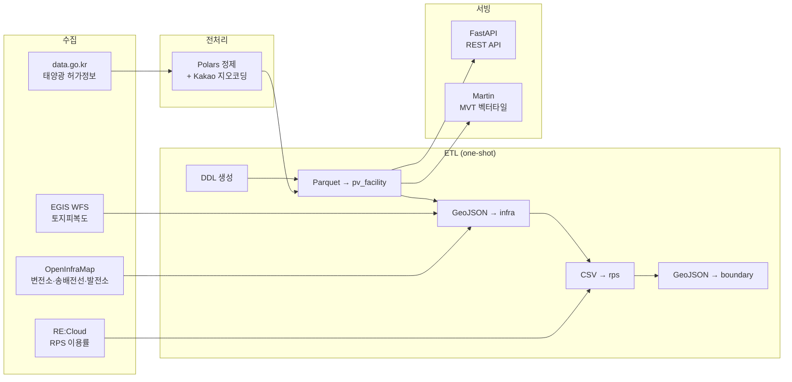
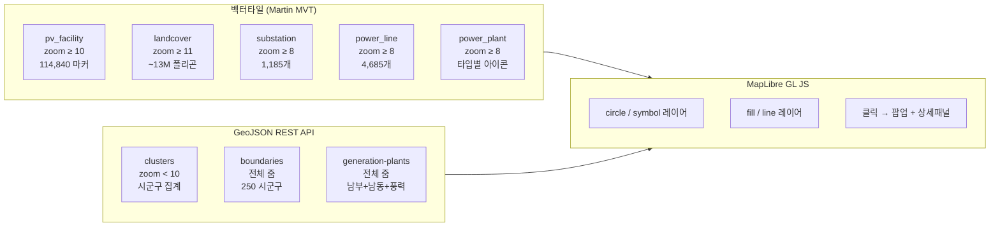
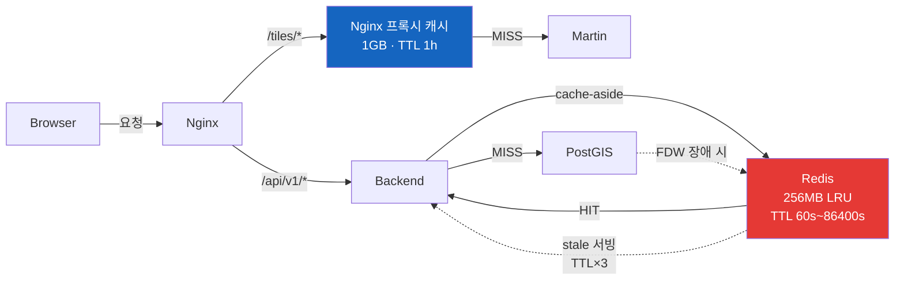

# Energy Hub

대한민국 태양광 발전소 114,840건의 전기사업허가 데이터를 자동 수집·정제·지오코딩하여, PostGIS 기반 지리공간 대시보드로 시각화하는 풀스택 프로젝트입니다. 실시간 전력수요, PV 발전량, 기상 관측 데이터를 FDW(Foreign Data Wrapper)로 통합하여 에너지 인프라 현황을 한눈에 파악할 수 있습니다.

## 주요 기능

### 지리공간 시각화
- **114,840개 PV 발전소** 마커 — 상태별(정상가동/가동중단/폐기) 색상 구분, 벡터타일 기반 초고속 렌더링
- **시군구 클러스터** — 저줌 레벨에서 250개 시군구 단위 집계 표시, 클릭 시 해당 지역으로 줌인
- **행정 경계** — 시군구 경계 폴리곤 오버레이
- **토지피복도** — EGIS 중분류 기반 ~13M 폴리곤, 줌 레벨별 적응형 간소화
- **인프라 레이어** — 변전소 1,185개, 송배전선 4,685개, 발전소(원자력/석탄/가스/수력/풍력/바이오 등) 타입별 아이콘
- **3D 지형** — MapTiler DEM 기반 지형 표현 (고도 과장 1.2x)

### 실시간 데이터 통합 (FDW)
- **전력수요** — 5분 간격 실시간 전력수요(MW), 공급량, 예비율 모니터링
- **PV 발전량** — 남부발전·남동발전 44개 태양광 발전소 시간별 발전량(kW)
- **풍력 발전량** — 한경/남동/서부 3개 풍력단지 발전 데이터
- **기상 관측** — 19개 관측소의 기온·습도·풍속·풍향·열수요 시계열

### 검색 및 분석
- **퍼지 검색** — `pg_trgm` 유사도 + ILIKE 패턴 결합, PV 발전소와 발전 설비 통합 검색
- **필터링** — 가동상태, 설비용량(kW), 설치연도 범위 필터
- **시군구 통계** — PV 설비용량·개수, RPS 이용률 기반 코로플레스 맵

## 서비스 아키텍처



## 데이터 흐름



## 지도 레이어 구조



## 캐싱 전략



| 계층 | 대상 | TTL | 비고 |
|------|------|-----|------|
| **Nginx** | 벡터타일 (`/tiles/`) | 1h | 1GB 디스크 캐시, `X-Cache-Status` 헤더 |
| **Redis** | 행정경계 | 24h | 변동 없는 데이터 |
| **Redis** | 인프라/발전소 | 10m~1h | FDW 장애 시 stale 서빙 (TTL×3) |
| **Redis** | 수요/기상/통계 | 1~5m | 실시간성 높은 데이터 |
| **Browser** | `Cache-Control` | 엔드포인트별 | `public, max-age` 헤더 |

## 기술 스택

| 영역 | 기술 |
|------|------|
| **프론트엔드** | React 18, TypeScript, Vite 6, Tailwind CSS, Zustand, Recharts, MapLibre GL JS 4 |
| **백엔드** | FastAPI, SQLAlchemy (async), asyncpg, GeoAlchemy2, Pydantic Settings |
| **데이터베이스** | PostgreSQL 16 + PostGIS 3.4, pg_trgm, FDW (postgres_fdw) |
| **타일 서버** | Martin (MapLibre) — PostGIS auto_publish → MVT |
| **캐시** | Redis 7 (hiredis) + orjson 직렬화 |
| **리버스 프록시** | Nginx 1.25 — rate limiting, gzip, 타일 캐시 |
| **데이터 파이프라인** | Polars, Playwright (크롤링), Kakao 지오코딩 API |
| **인프라** | Docker Compose (7 서비스), uv (Python 패키지 관리) |
| **디자인** | Hyperbeat Trader 스타일 — 풀블랙 배경, 핀테크 오더북 UI |

## 데이터베이스 스키마

### 로컬 테이블

| 테이블 | 행 수 | 지오메트리 | 용도 |
|--------|-------|-----------|------|
| `pv_facility` | 114,840 | POINT | PV 발전소 (data.go.kr) |
| `landcover` | ~13M | MULTIPOLYGON | EGIS 토지피복 중분류 |
| `substation` | 1,185 | POINT | 변전소 (OpenStreetMap) |
| `power_line` | 4,685 | LINESTRING | 송배전선 (OpenStreetMap) |
| `power_plant` | — | POINT | 발전소 (OpenStreetMap) |
| `admin_boundary` | 250 | MULTIPOLYGON | 시군구 행정경계 |
| `weather_station` | 19 | POINT | 기상 관측소 |
| `rps_utilization` | 228 | — | RPS 이용률 (RE:Cloud) |
| `mv_sigungu_summary` | 250 | — | 시군구 집계 MV |

### FDW 외래 테이블

| 테이블 | 소스 | 용도 |
|--------|------|------|
| `demand_5min` | demand-postgres | 5분 실시간 전력수요 (MW) |
| `heat_demand` | demand-postgres | 관측소별 기온·습도·풍속·열수요 |
| `nambu_plants` / `nambu_generation` | pv-data-postgres | 남부발전 PV 발전소 + 시간별 발전량 |
| `namdong_plants` / `namdong_generation` | pv-data-postgres | 남동발전 PV 발전소 + 시간별 발전량 |
| `wind_hangyoung` / `wind_namdong` / `wind_seobu` | pv-data-postgres | 풍력 발전 데이터 |

## API 엔드포인트

| Method | Path | 설명 | 캐시 |
|--------|------|------|------|
| GET | `/api/v1/map/points` | PV 마커 GeoJSON (bbox + 필터, 5000건 제한) | 120s |
| GET | `/api/v1/map/clusters` | 시군구 클러스터 집계 GeoJSON | 300s |
| GET | `/api/v1/map/choropleth` | 시군구 코로플레스 값 (geometry 미포함) | 300s |
| GET | `/api/v1/map/layers/infra` | 변전소 + 송배전선 GeoJSON (bbox) | 600s |
| GET | `/api/v1/map/layers/boundary` | 시군구 행정경계 전체 GeoJSON | 86400s |
| GET | `/api/v1/site/{id}` | PV 발전소 상세 + 최근접 관측소 | 1800s |
| GET | `/api/v1/site/{id}/timeseries` | 최근접 관측소 기상 시계열 | 900s |
| GET | `/api/v1/site/{id}/nearby` | 반경 내 PV 시설 검색 | 1800s |
| GET | `/api/v1/demand/current` | 최신 전력수요 (FDW) | 120s |
| GET | `/api/v1/demand/timeseries` | 전력수요 시계열 (5min/1h) | 300s |
| GET | `/api/v1/weather/stations` | 19개 관측소 + 최신 기상값 (FDW) | 300s |
| GET | `/api/v1/generation/plants` | 남부+남동+풍력 발전소 GeoJSON (FDW) | 3600s |
| GET | `/api/v1/generation/timeseries` | 발전소별 시간별 발전량 (FDW) | 900s |
| GET | `/api/v1/generation/summary` | 발전 현황 요약 (FDW) | 600s |
| GET | `/api/v1/stats/summary` | PV + 수요 + 인프라 통합 통계 | 60s |
| GET | `/api/v1/search` | pg_trgm 퍼지 검색 (PV + 발전설비) | 180s |
| GET | `/api/v1/landcover` | EGIS 토지피복 폴리곤 (bbox + zoom 적응형) | 300s |

API 문서: http://localhost:8088/docs (Swagger UI) · http://localhost:8088/redoc (ReDoc)

## 빠른 시작

### 요구사항

- Docker 및 Docker Compose
- (파이프라인 실행 시) Python 3.12+, [uv](https://docs.astral.sh/uv/)

### 실행

```bash
# 1. 레포 클론
git clone https://github.com/zongseung/Energy-hub.git
cd Energy-hub

# 2. 환경 변수 설정
cp src/.env.example src/.env

# 3. 풀스택 실행 (최초 빌드 + ETL 데이터 적재)
cd src/
docker compose up --build

# 4. 접속
# http://localhost:8088   — 대시보드 (nginx)
# http://localhost:8088/docs — API 문서 (Swagger)
```

### 개별 서비스 관리

```bash
cd src/

# 백엔드만 리빌드
docker compose up -d --build backend

# 프론트엔드만 리빌드
docker compose up -d --build frontend

# nginx 설정 리로드
docker compose up -d --force-recreate nginx

# Redis 캐시 초기화
docker compose exec redis redis-cli FLUSHALL

# 로그 확인
docker compose logs backend --tail 30
docker compose logs frontend --tail 30
```

### 데이터 파이프라인 (크롤링 · 전처리)

```bash
# 루트 디렉토리에서 실행
uv sync

# data.go.kr 태양광 허가정보 크롤링
uv run python generator_next/crawlers/data_go_kr_solar_download_playwright.py --headless

# 전처리 (정제 + 지오코딩)
uv run python generator_next/preprocessing/preprocess.py
```

## 프로젝트 구조

```
Energy-hub/
├── src/                          # Docker 풀스택
│   ├── docker-compose.yml
│   ├── backend/app/              # FastAPI 백엔드
│   │   ├── api/v1/               # 8개 라우터
│   │   ├── models/               # SQLAlchemy + GeoAlchemy2 ORM
│   │   ├── db/session.py         # async DB 세션
│   │   └── utils/                # Redis 캐시, bbox 헬퍼
│   ├── frontend/src/             # React 프론트엔드
│   │   ├── components/map/       # MapView (핵심 지도 컴포넌트)
│   │   ├── components/panels/    # 사이드패널 (대시보드/검색/상세)
│   │   ├── components/controls/  # 레이어 토글, 변수 선택
│   │   ├── stores/               # Zustand 상태관리
│   │   └── api/                  # REST API 클라이언트
│   ├── nginx/nginx.conf          # 리버스 프록시 설정
│   └── martin/martin.yaml        # 벡터타일 서버 설정
├── etl/                          # ETL 스크립트
│   ├── load_all.py               # 오케스트레이터
│   ├── schema/energy_hub_ddl.sql # DDL
│   └── setup_fdw.sql             # FDW 설정
├── generator_next/               # 데이터 파이프라인
│   ├── crawlers/                 # data.go.kr, OpenInfraMap 크롤러
│   └── preprocessing/            # Polars 전처리 + Kakao 지오코딩
└── plan/                         # PRD 문서
```

## 라이선스

MIT
